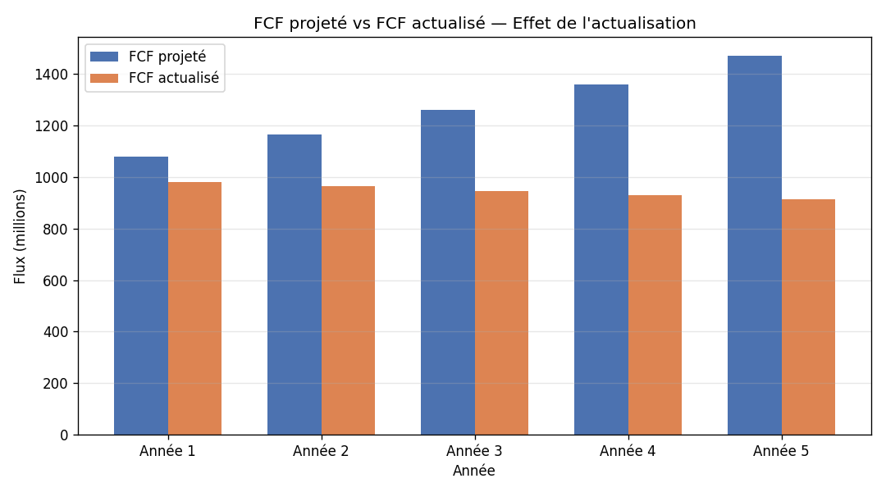

# Modèle de Valorisation DCF (Discounted Cash Flow)

Un modèle Python complet estimant la **valeur intrinsèque d'une entreprise** à partir de ses flux de trésorerie futurs actualisés, avec analyse de sensibilité et visualisation.

---

## Objectif

Le DCF (Discounted Cash Flow) est la méthode de valorisation de référence en corporate finance et private equity. Ce projet implémente le modèle complet, de la projection des flux jusqu'au prix par action, en appliquant le principe de la **valeur temps de l'argent** : un flux futur vaut moins qu'un flux présent, on l'actualise donc au WACC.

## Ce que fait le modèle

1. **Projection du Free Cash Flow** sur un horizon explicite (5 ans par défaut)
2. **Actualisation** de chaque flux à sa valeur présente via le WACC
3. **Valeur terminale** selon la méthode de Gordon-Shapiro (croissance perpétuelle)
4. **Enterprise Value** = somme des flux actualisés + valeur terminale actualisée
5. **Equity Value** et **prix par action** après déduction de la dette nette
6. **Analyse de sensibilité** : matrice du prix par action selon le WACC et la croissance perpétuelle
7. **Visualisation** : graphique comparant FCF projeté et FCF actualisé

## Exemple de résultat

```
VALEUR D'ENTREPRISE (EV)                 17 202,4
- Dette nette                             1 500,0
= VALEUR DES CAPITAUX PROPRES            15 702,4
PRIX PAR ACTION                             31,40
```

**Analyse de sensibilité — Prix par action**

| WACC \ g | 1.5% | 2.0% | 2.5% | 3.0% | 3.5% |
|----------|------|------|------|------|------|
| 8.0%  | 38.23 | 41.00 | 44.27 | 48.20 | 53.00 |
| 9.0%  | 32.58 | 34.56 | 36.85 | 39.52 | 42.67 |
| 10.0% | 28.26 | 29.73 | **31.40** | 33.32 | 35.52 |
| 11.0% | 24.85 | 25.98 | 27.25 | 28.67 | 30.28 |
| 12.0% | 22.10 | 22.99 | 23.97 | 25.06 | 26.28 |



## Technologies

- **Python 3**
- **NumPy** — calculs numériques
- **Matplotlib** — visualisation

## Comment lancer

```bash
# Installer les dépendances
pip install numpy matplotlib

# Lancer le modèle
python dcf_valuation.py
```

Le programme affiche les résultats en console et génère `dcf_graphique.png`.

## Personnalisation

Toutes les hypothèses sont regroupées en haut du fichier `dcf_valuation.py` :

```python
fcf_initial       = 1000.0   # Free Cash Flow de départ
croissance_fcf    = 0.08     # Croissance annuelle du FCF
wacc              = 0.10     # Taux d'actualisation
croissance_perpet = 0.025    # Croissance perpétuelle
dette_nette       = 1500.0   # Dette nette
nombre_actions    = 500.0    # Actions en circulation
```

Modifie ces valeurs pour valoriser n'importe quelle entreprise.

## Concepts financiers appliqués

- Valeur temps de l'argent et actualisation
- WACC comme taux d'actualisation
- Valeur terminale (Gordon-Shapiro)
- Passage de l'Enterprise Value à l'Equity Value
- Analyse de sensibilité multi-variables

---

*Projet réalisé dans le cadre de mon parcours en Finance (M1, ENCG Fès).*

