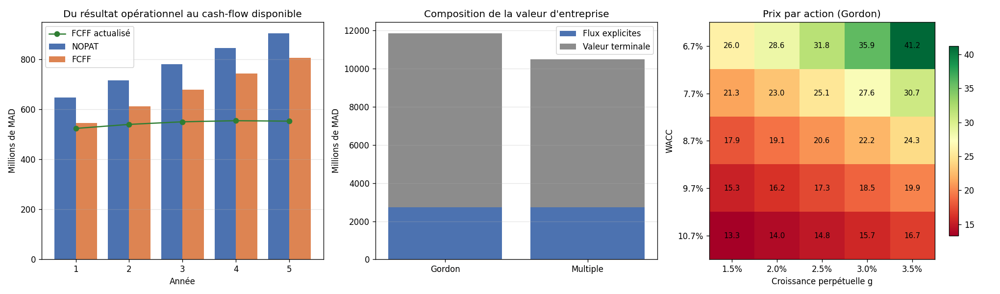

# Modèle de valorisation DCF en Python

Valorisation d'une entreprise par l'actualisation de ses flux de trésorerie disponibles (FCFF). Le modèle part des hypothèses opérationnelles, calcule le WACC, estime la valeur terminale par deux méthodes et aboutit à un prix par action, avec deux analyses de sensibilité et un export Excel.

Les données sont simulées (millions de MAD) et toutes les hypothèses se modifient en haut du fichier `dcf_valuation.py`.

## Déroulé du modèle

1. **Projection sur 5 ans** du chiffre d'affaires, de l'EBITDA et de l'EBIT à partir de taux de croissance et de marges.
2. **Free Cash Flow to Firm** : NOPAT + dotations aux amortissements − capex − variation du BFR.
3. **WACC** : coût des fonds propres par le MEDAF avec un bêta réendetté (formule de Hamada), coût de la dette après impôt, pondération à la structure financière cible.
4. **Valeur terminale** par la formule de Gordon et par un multiple EV/EBITDA de sortie, avec deux contrôles croisés : le multiple implicite de Gordon et la croissance implicite du multiple.
5. **Convention de milieu d'année** (paramétrable) pour refléter des flux encaissés tout au long de l'exercice.
6. **Passage de la valeur d'entreprise aux fonds propres** : dette financière, trésorerie, intérêts minoritaires et participations, puis prix par action et potentiel par rapport au cours.
7. **Sensibilités** du prix par action : WACC × croissance perpétuelle et WACC × multiple de sortie.

## Résultats avec les hypothèses par défaut

| | Gordon | Multiple de sortie (8,0x) |
|---|---|---|
| WACC | 8,72 % | 8,72 % |
| Valeur d'entreprise | 11 831 | 10 471 |
| Poids de la valeur terminale | 77 % | 74 % |
| Valeur des fonds propres | 10 281 | 8 921 |
| Prix par action | 20,56 | 17,84 |

Le multiple EV/EBITDA implicite de la méthode de Gordon est de 9,0x, proche de l'hypothèse de sortie de 8,0x : les deux méthodes restent cohérentes.



## Lancer le modèle

```bash
pip install numpy pandas matplotlib openpyxl
python dcf_valuation.py
```

Le programme affiche les tableaux dans la console et génère `dcf_graphique.png` et `dcf_resultats.xlsx`.

## Notions mises en œuvre

Valeur temps de l'argent, FCFF et NOPAT, besoin en fonds de roulement, MEDAF, bêta désendetté et réendetté, WACC, modèle de Gordon, multiples de valorisation, convention de milieu d'année, passage de l'EV à l'equity value, analyse de sensibilité.

---

Aymane Eladlouni, M2 Finance, ENCG Fès · [LinkedIn](https://www.linkedin.com/in/aymane-eladlouni)
